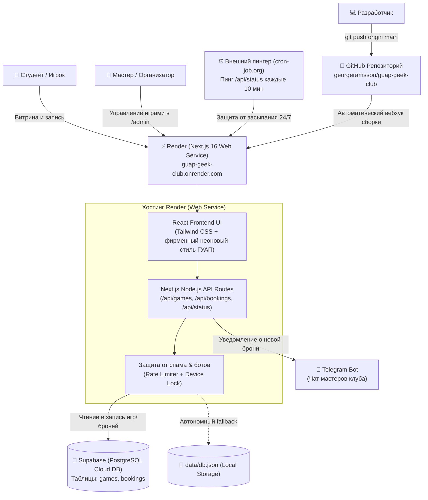

# 🌌 СОЗВЕЗДИЕ — Онлайн-запись на игры клуба ГУАП Geek Club

Официальный веб-сервис для анонсов и регистрации на настольные и ролевые игры клуба **«СОЗВЕЗДИЕ» (ГУАП Geek Club)**.

* **Рабочий сайт:** [https://guap-geek-club.onrender.com](https://guap-geek-club.onrender.com)
* **Панель мастера:** [https://guap-geek-club.onrender.com/admin](https://guap-geek-club.onrender.com/admin) *(Пин-код по умолчанию: `geek2026`)*
* **Telegram-канал клуба:** [https://t.me/guap_geek_club](https://t.me/guap_geek_club)
* **Группа ВКонтакте:** [https://vk.ru/guap_geek_club](https://vk.ru/guap_geek_club)
* **Пропуск для гостей не из ГУАП:** [https://t.me/hakich](https://t.me/hakich) *(Марк, руководитель клуба)*
* **Онлайн-диагностика статуса:** [https://guap-geek-club.onrender.com/api/status](https://guap-geek-club.onrender.com/api/status)
* **Репозиторий GitHub:** [https://github.com/georgeramsson/guap-geek-club](https://github.com/georgeramsson/guap-geek-club)

---

## 🎲 Возможности сервиса

### 1. Поддержка всех форматов мероприятий
- 🎲 **НРИ Ваншоты:** классические настольно-ролевые партии (D&D 5e, Warhammer Fantasy 4e, Вампиры: Маскарад, Pathfinder 2e) с ограничением мест и записью за игровой стол.
- 🗺️ **Кампании (серии сессий):** поддержка длительных ролевых сюжетов с несколькими датами сессий (например, 3–5 встреч). Все даты выводятся в карточке, в посте анонса и подсвечиваются в интерактивном календаре.
- 🎉 **Открытые игротеки:** свободный вход для всех желающих без предварительной брони мест.
- ✨ **Спецформаты («Прочее»):** возможность создания любых событий (турниры по ККИ, квизы, лекции по геймдизайну) с кастомным названием формата и выбором режима записи (с бронью или свободный вход).

### 2. Умная витрина и интерактивный календарь
- **Хронологическая сортировка:** предстоящие события автоматически сортируются от самых ближайших к более дальним.
- **Чистота ленты:** прошедшие и архивные партии скрыты с публичной витрины, чтобы не перегружать игроков.
- **Естественный русский формат дат:** даты выводятся в привычном визуальном представлении (`7 октября 2026`), без числовой и американской путаницы.
- **Интерактивный календарь:** просмотр сетки месяца с быстрым переходом к расписанию выбранного дня.

### 3. Удобство для мастеров и организаторов (ДМов)
- **Прямая связь с игроками:** имена записавшихся участников в карточках на главной и на странице игры (`/games/[id]`) кликабельны (ведут прямо в Telegram или профиль VK). Мастеру не нужен доступ в админку, чтобы связаться со своим столом.
- **Полное редактирование:** любой созданный анонс можно отредактировать в админке через модальное окно со всеми предзаполненными полями.
- **Аудитория по умолчанию:** в формах создания и редактирования автоматически подставляется `Ленсовета, 33-02`.
- **Генератор постов для соцсетей:** кнопка «Скопировать анонс» в один клик формирует готовый стильный текст с эмодзи и прямой ссылкой для публикации в группе ВК и Telegram-канале.

### 4. ⏳ Отложенная публикация мероприятий
- Возможность запланировать дату и время выхода анонса в админке.
- До наступления назначенного времени анонс скрыт от обычных игроков на витрине и в календаре.
- В панели мастера такой пост помечается статусом `⏳ Запланирован на DD.MM.YYYY в HH:MM` с кнопкой `⚡ Опубликовать сейчас` для быстрого досрочного выпуска.

### 5. 🤖 Уведомления в Telegram-чат организаторов
- При каждой новой записи участника бот мгновенно отправляет форматированную карточку в чат мастеров:
  * Название игры, система, мастер;
  * Дата проведения и аудитория;
  * Имя участника и кликабельная ссылка на его контакт (Telegram / VK);
  * Комментарий и опыт игрока;
  * Статус места (основной состав или лист ожидания) и текущая заполненность стола.

### 6. Лист ожидания (резерв) и защита от накруток
- **Автоматический лист ожидания:** если основной состав полон, новые игроки попадают в резерв. При отмене брони игроком из основы первый человек из резерва автоматически занимает освободившееся место.
- **Device Lock (`localStorage`):** защита от повторной случайной записи одного и того же человека.
- **IP Rate Limiting:** щадящий алгоритм ограничения запросов, оптимизированный под общий Wi-Fi университетских корпусов ГУАП.
- **Памятка для гостей:** для участников не из ГУАП размещена инструкция написать за 3 дня руководителю клуба Марку ([@hakich](https://t.me/hakich)) для заказа пропуска.

---

## 🏗 Архитектура: как всё устроено и работает вместе



### 1. GitHub (Хранилище кода и CI/CD)
* Все файлы исходного кода хранятся в репозитории `https://github.com/georgeramsson/guap-geek-club`.
* Основная ветка — `main`. При каждом пуше изменений (`git push origin main`) Render автоматически запускает новую сборку и обновляет сайт без простоя.

### 2. Render (Облачный хостинг веб-приложения)
* **Render.com (Web Service)** собирает и выполняет приложение на базе **Node.js (v20+)** и фреймворка **Next.js 16 (Turbopack)**.
* **Доступность в РФ:** В отличие от доменной зоны `*.vercel.app` (которая блокируется в РФ), домены `*.onrender.com` **полностью доступны в России без VPN**.
* **Серверная логика:** На Render полноценно работают серверные роуты Next.js: обработка бронирований, валидация данных, rate limiting, отправка уведомлений мастерам в Telegram и автопереключение на локальную базу при необходимости.
* **Безопасность:** Бесплатный автоматический SSL-сертификат (HTTPS), защита от DDoS и изоляция процессов.

### 3. Supabase (Облачная база данных PostgreSQL)
* В **Supabase** хранятся постоянные данные: список игр, даты сессий кампаний, ведущие, количество мест, участники и резерв.
* Даже при перезапуске сервера на Render, деплое новых версий или очистке кэша все брони и игры остаются в сохранности в базе данных.
* Подключение выполняется через защищенные ключи API (`SUPABASE_SERVICE_ROLE_KEY` или `NEXT_PUBLIC_SUPABASE_ANON_KEY`).

---

## ⏰ Защита от засыпания сервиса («Вечный онлайн» 24/7 на Render)

На бесплатном тарифе Render Web Service есть особенность: если к сайту никто не обращался в течение 15 минут, сервис временно **засыпает (spin down)** для экономии ресурсов. Первый пользователь после сна ожидает открытия сайта ~30–45 секунд (холодный старт контейнера).

### Как настроить бесплатный пинг за 2 минуты:
1. Зарегистрируйтесь на бесплатном сервисе мониторинга:
   * [cron-job.org](https://cron-job.org) (рекомендуется — бесплатный и без лимитов);
   * либо [uptimerobot.com](https://uptimerobot.com).
2. Создайте задачу мониторинга (Cronjob / HTTP Monitor):
   * **URL:** `https://guap-geek-club.onrender.com/api/status`
   * **Метод:** `GET`
   * **Интервал:** раз в **10 минут** (или каждые 5–10 минут).
3. Этот легковесный запрос проверяет подключение базы данных, возвращает `200 OK` и поддерживает контейнер Render в активном состоянии. Сайт открывается мгновенно 24 часа в сутки.

---

## 💾 Структура базы данных (Supabase)

База состоит из двух связанных таблиц в схеме `public` (файл миграции: [`supabase/schema.sql`](supabase/schema.sql)):

### Таблица `games` (Игры и мероприятия)
| Поле | Тип | Описание |
| :--- | :--- | :--- |
| `id` | `TEXT` | Уникальный ID игры (UUID или строка вида `game-1`) |
| `title` | `TEXT` | Название партии или игротеки |
| `system` | `TEXT` | Игровая система (`D&D 5e`, `WFRP 4e`, `Вампиры: Маскарад`, `Pathfinder 2e`, `Игротека`) |
| `master` | `TEXT` | Имя ведущего / организатора |
| `date` | `DATE` | Основная дата проведения (ГГГГ-ММ-ДД) |
| `time` | `TEXT` | Время проведения (например, `18:30` или `16:00 - 21:00`) |
| `location` | `TEXT` | Аудитория ГУАП (по умолчанию: `Ленсовета, 33-02`) |
| `max_players` | `INTEGER` | Лимит игроков за столом (для открытых игротек — `0`) |
| `description` | `TEXT` | Описание сюжета, прегенов и требований к игрокам |
| `tags` | `TEXT[]` | Список тегов (`Ваншот`, `Новички`, `18+` и др.) |
| `status` | `TEXT` | Статус игры: `'open'`, `'closed'`, `'archived'` |
| `event_type` | `TEXT` | Формат: `'rpg'`, `'open_boardgame'`, `'campaign'`, `'other'` |
| `custom_event_type` | `TEXT` | Произвольное название для формата `'other'` (например, «Турнир», «Квиз») |
| `dates` | `TEXT[]` | Массив дат для кампаний (`['2026-10-08', '2026-10-15']`) |
| `requires_booking` | `BOOLEAN` | Требуется ли предварительная запись через сайт |
| `publish_at` | `TIMESTAMPTZ`| Дата и время отложенной публикации (если запланировано) |

### Таблица `bookings` (Записи игроков)
| Поле | Тип | Описание |
| :--- | :--- | :--- |
| `id` | `TEXT` | Уникальный ID бронирования |
| `game_id` | `TEXT` | ID игры (внешний ключ к `games.id`) |
| `name` | `TEXT` | Имя и фамилия участника |
| `contact` | `TEXT` | Ссылка на профиль VK или ник в Telegram (`@username`, `t.me/...`) |
| `comment` | `TEXT` | Опыт в НРИ, пожелания по персонажу |
| `is_waitlist` | `BOOLEAN` | `false` — основной состав; `true` — лист ожидания (резерв) |
| `created_at` | `TIMESTAMPTZ` | Время создания записи |

---

## 🔒 Безопасность и конфиденциальность данных

> [!IMPORTANT]
> **Никакие реальные секретные токены, API-ключи или пароли не хранятся в репозитории Git!**
> Файл `.env.local` занесен в `.gitignore` и хранится исключительно на локальном компьютере разработчика или в зашифрованных Environment Variables платформы Render.

### Переменные окружения (Environment Variables)

Для работы в облаке Render (`Dashboard -> guap-geek-club -> Environment`) и локально в `.env.local` используются следующие переменные:

```env
# 1. Версия Node.js для сборки Next.js 16 на Render (Обязательно!)
NODE_VERSION=20.18.0

# 2. Подключение к облачной базе Supabase (Необязательно для локального запуска)
NEXT_PUBLIC_SUPABASE_URL=https://your-project.supabase.co
NEXT_PUBLIC_SUPABASE_ANON_KEY=your-anon-public-key
SUPABASE_SERVICE_ROLE_KEY=your-service-role-secret-key

# 3. Уведомления в Telegram-чат мастеров клуба (Необязательно)
TELEGRAM_BOT_TOKEN=your_bot_token_from_botfather
TELEGRAM_CHAT_ID=your_chat_or_channel_id
```

* Если переменные `SUPABASE_*` не заданы, приложение **автоматически работает в локальном файловом режиме** с хранением данных в `data/db.json`.
* Если переменные `TELEGRAM_*` не заданы, приложение фиксирует бронирования в базу, выводя уведомление в консоль сервера без падений.

---

## 👑 Руководство для мастеров клуба

### Как опубликовать игру или мероприятие:
1. Перейдите в панель мастера: [https://guap-geek-club.onrender.com/admin](https://guap-geek-club.onrender.com/admin).
2. Введите мастер-код (по умолчанию: `geek2026`).
3. Нажмите кнопку **«+ Создать анонс»**:
   * Выберите формат мероприятия: **НРИ Ваншот**, **Кампания**, **Игротека** или **Прочее**;
   * Для кампаний укажите все даты сессий через кнопку `+ Добавить еще дату`;
   * Для спецформата «Прочее» введите собственное название (например, «Квиз»);
   * Проверьте дату, время и аудиторию (по умолчанию стоит `Ленсовета, 33-02`);
   * При необходимости включите тумблер **«⏰ Отложенная публикация»** и задайте время выхода поста.
4. Нажмите **«Опубликовать анонс»**.

### Редактирование существующей игры:
На карточке любой игры в админке нажмите кнопку **«Редактировать»** с иконкой карандаша. Откроется окно со всеми параметрами, где можно изменить дату, время, количество мест, ведущего или снять таймер отложенной публикации.

---

## 💻 Локальный запуск на компьютере разработчика

```bash
# 1. Перейти в каталог проекта
cd "pet projects/guap-geek-club"

# 2. Установить зависимости
npm install

# 3. Создать локальный файл окружения на основе примера
cp .env.example .env.local

# 4. Запустить локальный сервер для разработки
npm run dev

# 5. Проверить сборку перед отправкой в репозиторий
npm run build
```

Сервер разработки будет доступен по адресу: [http://localhost:3000](http://localhost:3000).

---

## 🔄 Инструкция по передаче проекта новым координаторам

Когда потребуется передать управление сайтом другому организатору клуба:

### 1. Передача репозитория GitHub
1. Перейдите в настройки репозитория `https://github.com/georgeramsson/guap-geek-club/settings`.
2. Прокрутите вниз до блока **Danger Zone**.
3. Нажмите **Transfer ownership**, укажите GitHub-логин нового координатора и подтвердите паролем.

### 2. Передача сервиса на Render
1. В Render перейдите в **Dashboard** → воркспейс проекта.
2. Откройте **Settings** → **Members**.
3. Нажмите **Invite Member**, введите email нового координатора с ролью **Admin**.

### 3. Передача базы данных Supabase
1. В консоли [supabase.com](https://supabase.com) перейдите в **Project Settings** → **General**.
2. В блоке **Transfer project** укажите аккаунт или организацию нового владельца.

---

## 🩺 Диагностика состояния

Проверить доступность базы данных и конфигурацию сервера можно по прямой ссылке:
👉 **[https://guap-geek-club.onrender.com/api/status](https://guap-geek-club.onrender.com/api/status)**
