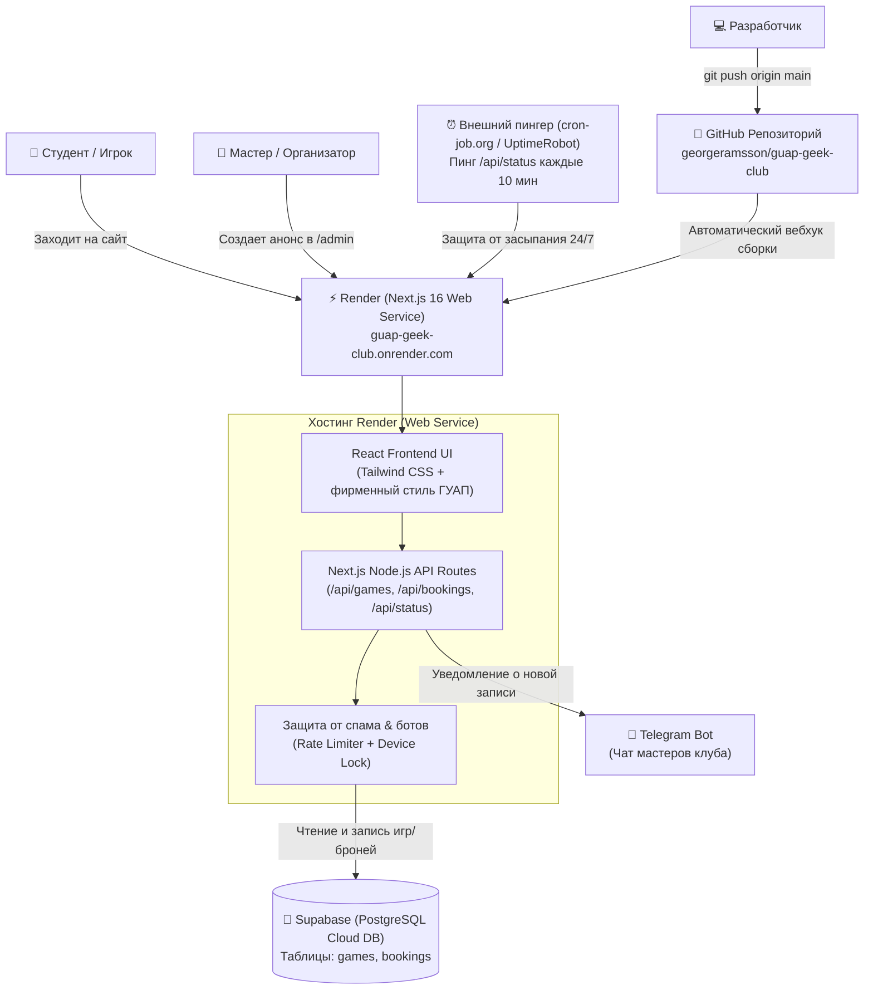

# 🌌 СОЗВЕЗДИЕ — Онлайн-запись на игры клуба ГУАП Geek Club

Официальный веб-сервис для анонсов и регистрации на настольные и ролевые игры клуба **«СОЗВЕЗДИЕ» (ГУАП Geek Club)**.

* **Рабочий сайт:** [https://guap-geek-club.onrender.com](https://guap-geek-club.onrender.com)
* **Панель мастера:** [https://guap-geek-club.onrender.com/admin](https://guap-geek-club.onrender.com/admin) (Пин-код: `geek2026`)
* **Telegram-канал:** [https://t.me/guap_geek_club](https://t.me/guap_geek_club)
* **Группа ВКонтакте:** [https://vk.ru/guap_geek_club](https://vk.ru/guap_geek_club)
* **Онлайн-диагностика статуса:** [https://guap-geek-club.onrender.com/api/status](https://guap-geek-club.onrender.com/api/status)
* **Репозиторий GitHub:** [https://github.com/georgeramsson/guap-geek-club](https://github.com/georgeramsson/guap-geek-club)

---

## 🏗 Архитектура: как всё устроено и работает вместе

Сервис развернут на современной облачной PaaS-инфраструктуре с поддержкой автономного Node.js runtime, баз данных и внешних интеграций:



### 1. GitHub (Хранилище кода и CI/CD)
* Все файлы исходного кода хранятся в репозитории `https://github.com/georgeramsson/guap-geek-club`.
* Основная ветка — `main`. При каждом пуше изменений (`git push origin main`) Render автоматически запускает новую сборку и обновляет сайт без простоя.

### 2. Render (Облачный хостинг веб-приложения)
* **Render.com (Web Service)** собирает и выполняет приложение на базе **Node.js (v20+)** и фреймворка **Next.js 16**.
* **Доступность в РФ:** В отличие от доменной зоны `*.vercel.app` (которая заблокирована РКН), домены `*.onrender.com` **полностью доступны в России без VPN**.
* **Серверная логика:** На Render полноценно работают серверные роуты Next.js: обработка бронирований, валидация данных, rate limiting, отправка уведомлений мастерам в Telegram и автопереключение на локальную базу при необходимости.
* **Безопасность:** Бесплатный автоматический SSL-сертификат (HTTPS), защита от DDoS и изоляция процессов.

### 3. Supabase (Облачная база данных PostgreSQL)
* В **Supabase** хранятся постоянные данные: список игр, ведущие, количество мест, участники и резерв.
* Даже при перезапуске сервера на Render, деплое новых версий или очистке кэша все брони и игры остаются в сохранности в базе данных.
* Подключение выполняется через защищенные ключи API (`SUPABASE_SERVICE_ROLE_KEY` или `NEXT_PUBLIC_SUPABASE_ANON_KEY`).

---

## ⏰ Защита от засыпания сервиса («Вечный онлайн» 24/7 на Render)

На бесплатном тарифе Render Web Service есть особенность: если к сайту никто не обращался в течение 15 минут, сервис временно **засыпает (spin down)** для экономии ресурсов. Первый пользователь после сна ожидает открытия сайта ~30–45 секунд (холодный старт контейнера).

### Как настроить бесплатный пинг за 2 минуты:
1. Зарегистрируйтесь на бесплатном сервисе мониторинга:
   * [cron-job.org](https://cron-job.org) (рекомендуется — бесплатный и без лимитов);
   * либо [uptimerobot.com](https://uptimerobot.com).
2. Создайте задачу мониторинга (Cronjob / HTTP Monitor):
   * **URL:** `https://guap-geek-club.onrender.com/api/status`
   * **Метод:** `GET`
   * **Интервал:** раз в **10 минут** (или каждые 5–10 минут).
3. Этот легковесный запрос проверяет подключение базы данных, возвращает `200 OK` и поддерживает контейнер Render в активном состоянии. Сайт открывается мгновенно 24 часа в сутки.

---

## 💾 Структура базы данных (Supabase)

База состоит из двух связанных таблиц в схеме `public`:

### Таблица `games` (Игры и игротеки)
| Поле | Тип | Описание |
| :--- | :--- | :--- |
| `id` | `TEXT` | Уникальный идентификатор игры (UUID или строка вида `game-1`) |
| `title` | `TEXT` | Название партии или игротеки |
| `system` | `TEXT` | Игровая система (`D&D 5e`, `WFRP 4e`, `Вампиры: Маскарад`, `Pathfinder 2e`, `Игротека`) |
| `master` | `TEXT` | Имя и позывной мастера / ведущего |
| `date` | `DATE` | Дата проведения (ГГГГ-ММ-ДД) |
| `time` | `TEXT` | Время проведения (например, `18:30` или `16:00 - 21:00`) |
| `location` | `TEXT` | Корпус и аудитория ГУАП (например, `Большая Морская 67, ауд. 13-04`) |
| `max_players` | `INTEGER` | Лимит игроков за столом (для открытых игротек — `0`) |
| `description` | `TEXT` | Художественное описание сюжета и требования к игрокам |
| `tags` | `TEXT[]` | Список тегов (`Ваншот`, `Новички`, `18+` и др.) |
| `status` | `TEXT` | Статус игры: `'open'` (открыта), `'closed'` (набор закрыт), `'archived'` (прошедшая) |
| `event_type` | `TEXT` | Тип события: `'rpg'` (НРИ с записью) или `'open_boardgame'` (игротека со свободным входом) |
| `requires_booking` | `BOOLEAN` | Требуется ли предварительная запись через сайт |

### Таблица `bookings` (Записи игроков)
| Поле | Тип | Описание |
| :--- | :--- | :--- |
| `id` | `TEXT` | Уникальный ID записи |
| `game_id` | `TEXT` | ID игры (внешний ключ к `games.id`) |
| `name` | `TEXT` | Имя и фамилия студента |
| `contact` | `TEXT` | Ссылка на профиль VK или ник в Telegram для связи |
| `comment` | `TEXT` | Опыт игрока, пожелания по персонажу |
| `is_waitlist` | `BOOLEAN` | `false` — место за столом; `true` — лист ожидания (резерв) |
| `created_at` | `TIMESTAMPTZ` | Время создания записи |

### ⚡ Логика Листа Ожидания (Резерва)
1. Если на игру с лимитом в 4 места записывается 5-й человек, система не отклоняет его, а автоматически помечает флагом `is_waitlist = true`.
2. Если один из первых 4 игроков отменяет запись, система автоматически переводит первого человека из резерва в основной состав (`is_waitlist` становится `false`).

### 🛡 Защита от мульти-бронирования и ботов
1. **Device Lock (`localStorage`):** После успешной брони браузер игрока запоминает факт записи. При повторной попытке открывается окно: *«Вы уже записаны на эту игру с этого устройства»* с кнопками «Скопировать ссылку для друга» или «Отменить мою запись».
2. **IP Rate Limiting:** Специальный скользящий ограничитель запросов, адаптированный под общий студенческий Wi-Fi ГУАП (не более 1 запроса в 45 сек на одну игру, максимум 2 регистрации за 10 минут).

---

## 🔑 Переменные окружения (Environment Variables)

Все секретные ключи настраиваются в панели **Render** (`Dashboard -> guap-geek-club -> Environment -> Add Environment Variable`) и локально в файле `.env.local`:

```env
# 1. Версия Node.js для сборки Next.js 16 на Render (Обязательно!)
NODE_VERSION=20.18.0

# 2. Подключение к облачной базе Supabase
NEXT_PUBLIC_SUPABASE_URL=https://ваш-проект.supabase.co
NEXT_PUBLIC_SUPABASE_ANON_KEY=ваш_anon_public_key
SUPABASE_SERVICE_ROLE_KEY=ваш_service_role_secret_key

# 3. Уведомления в Telegram-чат мастеров клуба (Опционально)
TELEGRAM_BOT_TOKEN=123456789:ABCdefGhIJKlmNoPQRsTUVwxyZ
TELEGRAM_CHAT_ID=-1001234567890
```

> **Важно:** Сервер проекта содержит автоматический фильтр `sanitizeSupabaseUrl`, поэтому даже если при копировании адреса проекта Supabase случайно захватится лишний слэш или `/rest/v1`, сервер сам нормализует адрес до рабочего вида.

---

## 👑 Руководство для мастеров клуба

### Как опубликовать новую игру:
1. Перейдите по адресу: [https://guap-geek-club.onrender.com/admin](https://guap-geek-club.onrender.com/admin).
2. Введите мастер-код (по умолчанию: `geek2026`).
3. Заполните форму анонса:
   * Выберите систему (`D&D 5e`, `WFRP 4e`, `Вампиры: Маскарад`, `Pathfinder 2e`, `Игротека`).
   * Укажите дату, время и корпус ГУАП.
   * Укажите количество мест за столом (для игротеки можно поставить 0).
4. Нажмите **«Создать анонс»**. Игра мгновенно появится на главной странице.

### Генератор постов для соцсетей:
На карточке каждой игры в Панели мастера есть кнопка **«Скопировать анонс»**. Она формирует красивый готовый текст с эмодзи и прямой ссылкой для публикации в группе [ВКонтакте](https://vk.ru/guap_geek_club) или в [Telegram-канале](https://t.me/guap_geek_club).

---

## 🔄 Инструкция по передаче проекта (Handoff дочке / новым координаторам)

Когда потребуется передать управление сайтом другому человеку:

### 1. Передача репозитория GitHub
1. Зайдите в репозиторий `https://github.com/georgeramsson/guap-geek-club`.
2. Перейдите в **Settings** (Настройки репозитория) → прокрутите вниз до блока **Danger Zone**.
3. Нажмите кнопку **Transfer ownership**.
4. Введите GitHub-логин нового владельца и подтвердите передачу паролем. Репозиторий перенесётся со всей историей коммитов.

### 2. Передача сервиса на Render
**Вариант А (Добавить администратора в команду):**
1. В Render перейдите в **Dashboard** → выберите ваш воркспейс / аккаунт.
2. Откройте **Settings** → **Members**.
3. Нажмите **Invite Member**, введите email нового координатора и выберите роль **Admin**.

**Вариант Б (Развернуть на аккаунте нового владельца за 3 минуты):**
1. Новый владелец входит на [render.com](https://render.com) через свой GitHub.
2. Нажимает **New +** → **Web Service** → подключает переданный репозиторий `guap-geek-club`.
3. Указывает параметры:
   * **Runtime:** `Node`
   * **Build Command:** `npm run build`
   * **Start Command:** `npm run start`
   * **Instance Type:** `Free`
4. В разделе **Environment** добавляет переменные окружения (`NODE_VERSION`, ключи Supabase и Telegram).
5. Нажимает **Deploy Web Service**.

### 3. Передача базы данных Supabase
1. Зайдите в проект на [supabase.com](https://supabase.com).
2. В левом меню выберите **Project Settings** (иконка шестеренки) → **General**.
3. В блоке **Transfer project** нажмите **Transfer Project**.
4. Укажите аккаунт или организацию нового владельца в Supabase.
*(Все таблицы, игры и брони останутся нетронутыми, а ключи API не изменятся).*

---

## 💻 Локальный запуск на компьютере разработчика

Если нужно внести доработки в код:

```bash
# 1. Перейти в каталог проекта
cd "pet projects/guap-geek-club"

# 2. Установить зависимости
npm install

# 3. Скопировать переменные окружения
cp .env.example .env.local
# (заполните .env.local своими ключами или оставьте пустым для работы в автономном режиме на файловой базе)

# 4. Запустить локальный сервер для разработки
npm run dev

# 5. Проверить сборку перед отправкой на продакшн
npm run build
```

Сервер разработки откроется по адресу: [http://localhost:3000](http://localhost:3000).

---

## 🩺 Диагностика и проверка работоспособности

В проекте есть встроенный эндпоинт мониторинга состояния:
👉 **[https://guap-geek-club.onrender.com/api/status](https://guap-geek-club.onrender.com/api/status)**

При нормальной работе он возвращает JSON со статусом:
```json
{
  "status": "supabase_connected",
  "message": "Облачная база Supabase успешно подключена и отвечает!",
  "gamesCount": 1,
  "env": {
    "NEXT_PUBLIC_SUPABASE_URL": true,
    "NEXT_PUBLIC_SUPABASE_ANON_KEY": true,
    "SUPABASE_SERVICE_ROLE_KEY": true,
    "url_auto_fixed": false,
    "normalized_url": "https://your-project.supabase.co"
  }
}
```
Если база временно недоступна или переменные не настроены, сервер вернёт понятное описание проблемы со статусом ошибки или сообщением о работе в локальном файловом режиме (`local_mode`).
